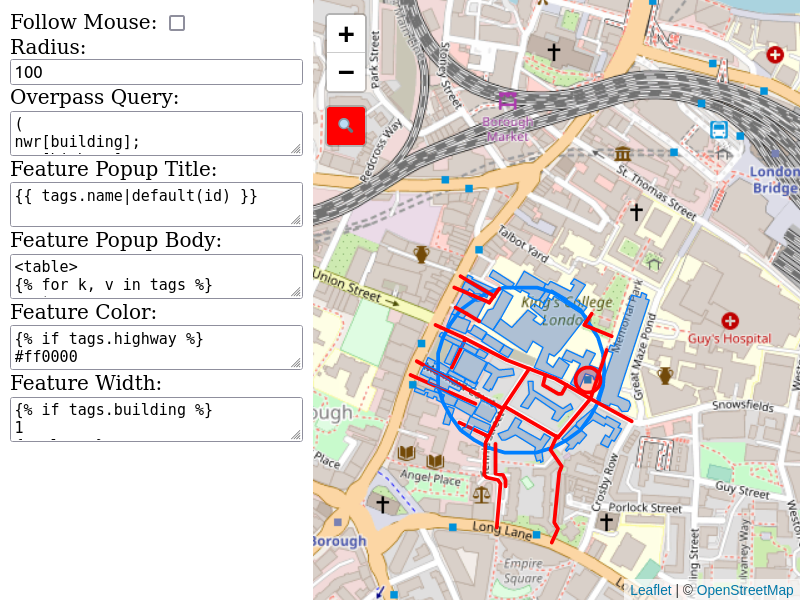

# leaflet-overpass-lens
On a Leaflet Map, query an area around the mouse pointer for map items via Overpass API (an OpenStreetMap database server)

-> [DEMO](https://xover.mud.at/~skunk/leaflet-overpass-lens/)

## Screenshot


See also this short screencast: https://youtu.be/JTzVa9E0Yo8

## Usage
### Plain HTML/JS
Run on a shell:
```sh
npm install leaflet-overpass-lens leaflet
```

Create a HTML file `index.html`:
```
<html>
<head>
  <link rel="stylesheet" href="node_modules/leaflet/dist/leaflet.css"/>
  <link rel="stylesheet" href="node_modules/leaflet-overpass-lens/dist/leaflet-overpass-lens.css"/>
  <script src="node_modules/leaflet/dist/leaflet.js"></script>
  <script src="node_modules/leaflet-overpass-lens/dist/leaflet-overpass-lens.js"></script>
</head>
<body>
  <div id="map" style="position: absolute; left: 0; right: 0; top: 0; bottom: 0;"></div>
  <script>
// use the code from the "Code" section below
  </script>
</body>
</html>
```

You might also need a web server, e.g. Apache or [http-server](https://www.npmjs.com/package/http-server).

### With browserify (or other packaging tools)
Create/update your package.json:
```json
{
  "scripts": {
    "build": "browserify -g browserify-css app.js -o dist/app.js"
  }
}
```

Run on a shell:
```sh
npm install --save leaflet-overpass-lens leaflet overpass-frontend browserify
```

Create a file app.js with the following code:
```js
const OverpassFrontend = require('overpass-frontend')
require('leaflet')
require('leaflet-overpass-lens')

// use the code from the "Code" section below
```

Create a HTML file `index.html`:
```
<html>
  <head>
    <link rel="stylesheet" href="node_modules/leaflet/dist/leaflet.css"/>
    <link rel="stylesheet" href="node_modules/leaflet-overpass-lens/dist/leaflet-overpass-lens.css"/>
  </head>
  <body>
    <div id="map" style="position: absolute; left: 0; right: 0; top: 0; bottom: 0;"></div>
    <script src="dist/app.js"></script>
  </body>
</html>
```

Build your application:
```sh
npm run build
```

You might also need a web server, e.g. Apache or [http-server](https://www.npmjs.com/package/http-server).

### Code
```js
const overpassURL = '//overpass-api.de/api/interpreter'
// const overpassURL = 'map.osm' // Download a .osm file to this directory and use this instead
const overpassFrontend = new OverpassFrontend(overpassURL)

const map = L.map('map').setView([51.505, -0.09], 15)

// Map Background
L.tileLayer('//{s}.tile.openstreetmap.org/{z}/{x}/{y}.png', { attribution: '&copy; <a href="http://www.openstreetmap.org/copyright">OpenStreetMap</a>' }
).addTo(map)

// you can omit these values; shown are the default values.
const options = {
  position: 'topleft', // position of the control
  continuous: false, // if true, lens will follow mouse and update continuously
  icon: '<span>🔍</span>', // which icon to use on the control
  radius: 100, // radius around the mouse pointer
  radiusUnits: 'meters', // units
  bufferStyle: { weight: 3, color: '#007fff', fill: false } // the visible buffer around the mouse position
}

// Configure the overlay. For more options, please check https://github.com/plepe/overpass-layer#readme
const layerOptions = {
  overpassFrontend: overpassFrontend,
  minZoom: 15,
  feature: { markerSymbol: '' }, // hide markers, image won't be found
  query: 'nwr', // load everything in that area
}

L.overpassLens(options, layerOptions).addTo(map)
```
